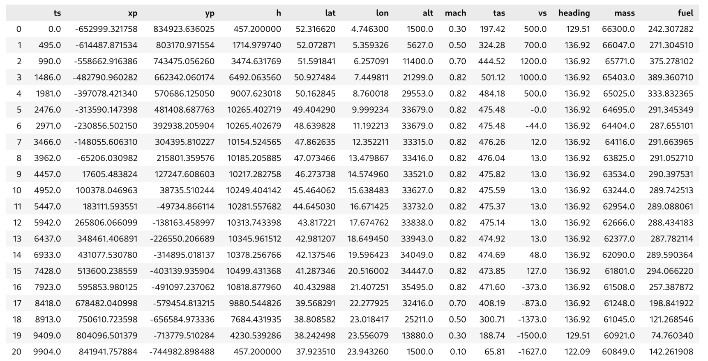
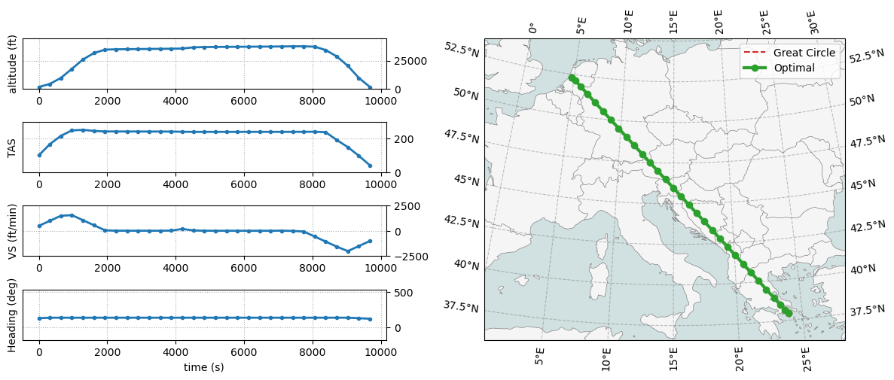

# OpenAP Trajectory Optimizer

This repository contains the flight trajectory optimizer module of [OpenAP](https://github.com/junzis/openap).

A more detailed user guide can be found at: https://openap.dev/top.

## Install

OpenAP.top uses `cfgrib` for integrating wind data, `cartopy` for plotting, and a few other libraries. I recommend using `conda` to install these dependencies. Following is an example how I set it up on my computer for testing.

1. Create a new conda environment (`openap-env`) and install the necessary packages:

```sh
mamba create -n openap-env python=3.11 -c conda-forge
mamba activate openap-env
mamba install cfgrib cartopy casadi scikit-learn -c conda-forge
```

2. Install the most recent version of `openap`:

```sh
pip install --upgrade git+https://github.com/junzis/openap
```

3. Install the most recent version of `openap-top`:

```sh
pip install --upgrade git+https://github.com/junzis/openap-top
```

## Quick start

Example code to generate a fuel-optimal flight between two airports:

```python
from openap import top

optimizer = top.CompleteFlight("A320", "EHAM", "LGAV", m0=0.85)

flight = optimizer.trajectory(objective="fuel")
```

You can specify different objective functions as:

```python
flight = optimizer.trajectory(objective="ci:30")
flight = optimizer.trajectory(objective="gwp100")
flight = optimizer.trajectory(objective="gtp100")
```

The final `flight` object is a Pandas DataFrame. The following is an example:



## Use wind data

To enable wind in your optimizer, you must first download meteorological data in `grib` format from ECMWF, for example, the ERA5 data at https://doi.org/10.24381/cds.bd0915c6.

Then enable the wind for the defined optimizer.

Example code:

```python
from openap import top
from openap.top import wind

optimizer = top.CompleteFlight("A320", "EHAM", "LGAV", m0=0.85)

fgrib = "path_to_the_wind_data.grib"
windfield = wind.read_grib(fgrib)
optimizer.enable_wind(windfield)

flight = optimizer.trajectory(objective="fuel")
```

If your grib file includes multiple timestamps, make sure to filter the correct time in the previous `windfield` object (pandas DataFrame).

### Example of an optimal flight:


