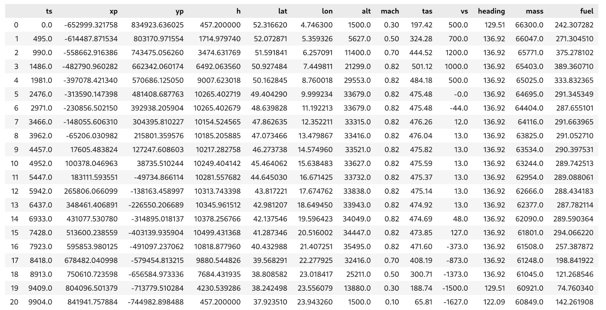
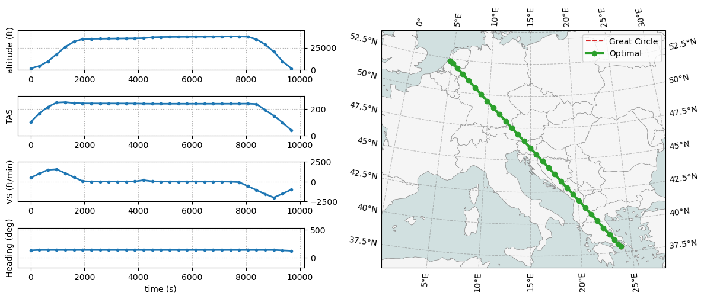

# opentop: Open Trajectory Optimizer

`opentop` is **v2 of [`openap-top`](https://pypi.org/project/openap-top/)**. The package has been renamed and restructured: what used to be installed as `openap-top` and imported as `openap.top` now installs as `opentop` and imports as `import opentop`. The three headline changes in v2.0:

- **New Opti-stack backend** — NLP construction has moved to CasADi's Opti stack, removing ~400 lines of boilerplate and fixing several long-standing bugs.
- **Standalone package** — `opentop` is no longer a namespace extension of `openap`; it installs as a top-level package and imports as `import opentop`.
- **Command-line interface** — `opentop optimize` and `opentop gengrid` expose the optimizer and grid-cache builder from the shell.

See [What's New in 2.0](#whats-new-in-20) below for the full migration table.

Flight trajectory optimizer based on the [OpenAP](https://github.com/junzis/openap) aircraft performance model.

`opentop` uses non-linear optimal control via direct collocation (CasADi + IPOPT) to generate optimal flight trajectories. It provides simple interfaces for:

- Complete flight trajectories (takeoff → cruise → landing)
- Individual phases: climb, cruise, descent
- Fuel-optimal, time-optimal, cost-index, and climate-optimal objectives
- Wind integration
- Custom 4D grid cost functions (contrails, weather, airspace)
- User-defined objective functions and constraints

## 🕮 User Guide

Detailed guide and examples: <https://openap.dev/optimize>.

## Install

From PyPI:

```sh
pip install --upgrade opentop
```

From the development branch:

```sh
pip install --upgrade git+https://github.com/junzis/openap
pip install --upgrade git+https://github.com/junzis/opentop
```

`opentop` is a standalone package. Prior to v2.0 it shipped as `openap.top`, a namespace extension of `openap`; v2.0 drops that and installs as a top-level `opentop` package instead.

## Quick Start

### A simple optimal flight

```python
import opentop

optimizer = opentop.CompleteFlight("A320", "EHAM", "LGAV", m0=0.85)
flight = optimizer.trajectory(objective="fuel")
```

`flight` is a Pandas DataFrame with columns for position, altitude, mass,
Mach, TAS, vertical rate, heading, and per-segment `fuel_cost`.



### Other built-in objectives

```python
optimizer.trajectory(objective="time")      # minimum time
optimizer.trajectory(objective="ci:30")     # cost index 30
optimizer.trajectory(objective="gwp100")    # 100-yr global warming potential
optimizer.trajectory(objective="gtp100")    # 100-yr global temperature potential
```

The supported climate metrics are `gwp20`, `gwp50`, `gwp100`, `gtp20`, `gtp50`, `gtp100`.

### Choosing a different engine

```python
optimizer = opentop.CompleteFlight(
    "A320", "EHAM", "LGAV", m0=0.85, engine="CFM56-5B4"
)
```

### Flight phase optimizers

```python
cruise    = opentop.Cruise("A320", "EHAM", "LGAV", m0=0.85).trajectory()
climb     = opentop.Climb("A320", "EHAM", "LGAV", m0=0.85).trajectory()
descent   = opentop.Descent("A320", "EHAM", "LGAV", m0=0.85).trajectory()

# Multi-phase: optimizes climb, cruise, descent sequentially
full = opentop.MultiPhase("A320", "EHAM", "LGAV", m0=0.85).trajectory()
```

`Cruise` also supports constant-altitude, constant-Mach, and fixed-track modes:

```python
opt = opentop.Cruise("A320", "EHAM", "LGAV", m0=0.85)
opt.fix_cruise_altitude()
opt.fix_mach_number()
opt.fix_track_angle()
flight = opt.trajectory()
```

### Wind integration

Download ERA5 (or similar) meteorological data in GRIB format, then:

```python
import opentop

windfield = opentop.tools.read_grids("wind.grib")

optimizer = opentop.CompleteFlight("A320", "EHAM", "LGAV", m0=0.85)
optimizer.enable_wind(windfield)

flight = optimizer.trajectory(objective="fuel")
opentop.vis.trajectory(flight, windfield=windfield, barb_steps=15)
```



### Custom grid cost (contrails, weather, airspace)

Build a CasADi interpolant from a DataFrame with columns `longitude`, `latitude`, `height` (m), `cost`, and optionally `ts`:

```python
interpolant = opentop.tools.interpolant_from_dataframe(df_cost)

def contrail_objective(x, u, dt, **kwargs):
    grid_cost = optimizer.obj_grid_cost(
        x, u, dt, interpolant=kwargs["interpolant"], n_dim=3
    )
    fuel_cost = optimizer.obj_fuel(x, u, dt)
    return grid_cost + fuel_cost

flight = optimizer.trajectory(
    objective=contrail_objective,
    interpolant=interpolant,
    n_dim=3,
)
```

See <https://openap.dev/optimize/contrails.html> for a full contrail + CO₂ example.

### Custom objective functions

Any callable with signature `(x, u, dt, **kwargs) -> ca.MX` can be used:

```python
def my_objective(x, u, dt, **kwargs):
    # x: state [xp, yp, h, mass, ts]
    # u: control [mach, vs, psi]
    return your_cost_expression

flight = optimizer.trajectory(objective=my_objective)
```

### Precomputed grid caches (recommended for contrail + CO₂)

Linear interpolation over a 4D contrail-cost grid has discontinuous derivatives at every grid cell boundary, which can cause IPOPT's line search to oscillate on non-convex blended objectives. The fix is to use a cubic B-spline interpolant, which has continuous derivatives. But building a bspline over a large grid can take several minutes, so we expose a cache utility:

```python
from opentop.tools import cached_interpolant_from_dataframe

interpolant = cached_interpolant_from_dataframe(
    df_cost, "cache/contrail.casadi", shape="bspline"
)
```

First call builds the bspline and writes it to disk (~1-3 minutes for a 60k-point slice); subsequent calls load the cache in under a second.

If your grid only covers the altitude band where contrails actually form (typically FL200-FL440), extend it with zero-cost levels outside that band before building the interpolant — otherwise `opentop.CompleteFlight` trajectories that start and end on the ground will query the interpolant outside its data range. The `opentop` CLI has a helper for this:

```sh
opentop gengrid --in raw_grid.parquet --out grid.casadi \
    --bbox 35:57,-9:7 --time 2022-02-20T10:00,2022-02-20T14:00 \
    --pad-altitudes
```

`--pad-altitudes` is on by default and adds zero-cost rows at altitudes from 0 to FL480 so the interpolant returns 0 (physically correct — no contrails below ~FL200 or above ~FL440) outside the data band.

## Command-line interface

Installing `opentop` also installs the `opentop` executable, which exposes two subcommands: `optimize` (run a trajectory optimization) and `gengrid` (precompute a grid-cost interpolant).

### `opentop optimize`

Run a trajectory optimization without writing any Python:

```sh
opentop optimize EHAM EDDF -a A320 --phase cruise --obj fuel
```

A concise solver summary (status, iterations, objective, fuel burn, max altitude, flight time) is printed to stdout. Pass `-o flight.parquet` to also save the full trajectory DataFrame.

Supported objectives: `fuel`, `time`, `ci:N` (cost index, any integer), `gwp20`/`gwp50`/`gwp100`, `gtp20`/`gtp50`/`gtp100`, and `grid` (requires `--grid FILE`).

Blended objectives are written as a weighted sum:

```sh
opentop optimize EHAM EDDF -a A320 --phase all \
    --obj "0.3*fuel+0.7*grid" \
    --grid contrail.casadi
```

Common flags:

| flag | purpose |
|---|---|
| `-a`, `--aircraft` | aircraft type (required), e.g. `A320` |
| `--phase` | `all` (CompleteFlight, default), `cruise`, `climb`, `descent` |
| `--obj` | objective expression — single term or weighted sum |
| `--m0` | initial mass as a fraction of MTOW (default `0.85`) |
| `--grid` | cost-grid file; `.casadi` cache preferred, `.parquet` accepted with a slow-path warning |
| `--max-iter` | IPOPT iteration cap (default `1500`) |
| `-o`, `--output` | write the trajectory DataFrame to a parquet file |
| `-v`, `--debug` | verbose IPOPT output |

### `opentop gengrid`

Build and cache a CasADi interpolant from a raw cost grid:

```sh
opentop gengrid --in raw_grid.parquet --out contrail.casadi \
    --bbox 35:57,-9:7 \
    --time 2022-02-20T10:00,2022-02-20T14:00 \
    --shape bspline
```

The resulting `.casadi` file loads in under a second (vs. minutes to rebuild a bspline from raw grid data), so keep it on disk and pass it to `opentop optimize --grid`.

Use `opentop --help`, `opentop optimize --help`, and `opentop gengrid --help` for the full option list.

## Accessing Solver Results

After calling `.trajectory()`, the optimizer exposes:

```python
optimizer.solver          # CasADi OptiSol object
optimizer.solver.stats()  # solver statistics dict ("success", "iter_count", ...)
optimizer.objective_value # final objective value (float)
```

## Benchmarks

Run benchmarks across versions to verify performance:

```sh
./benchmark.sh                 # Benchmark HEAD (local dev code)
./benchmark.sh v2.0.0          # Benchmark a specific PyPI release
./benchmark.sh v1.11.0 v2.0.0  # Benchmark multiple versions sequentially
```

Reports land in `tests/benchmarks/<version>.txt`.

## What's New in 2.0

Version 2.0 is a major refactor. Most user code keeps the same shape, but a few things have moved:

| v1.x | v2.0 |
|---|---|
| `pip install openap-top` | `pip install opentop` |
| `from openap import top` | `import opentop` |
| `top.Cruise(...)` | `opentop.Cruise(...)` |
| `optimizer.change_engine()` dropped | `opentop.Cruise(..., engine="CFM56-5B4")` |
| `optimizer.solution["f"]` | `optimizer.objective_value` |
| `optimizer.solver` was a `ca.nlpsol` callable | now a `ca.OptiSol` object |
| `setup(max_iteration=...)` | `setup(max_iter=...)` |
| — | new CLI: `opentop optimize ORIGIN DEST ...` and `opentop gengrid ...` |
| — | new `opentop.tools.cached_interpolant_from_dataframe()` for disk-cached bspline interpolants |

The NLP construction moved to CasADi's Opti stack, which removed ~400 lines of boilerplate and cleaned up several bugs. The module rename from `openap.top` to `opentop` eliminates the namespace-extension install mode that used to require `.pth` tricks.

See the [changelog](https://github.com/junzis/opentop/releases) for details.

## License

GNU LGPL v3
